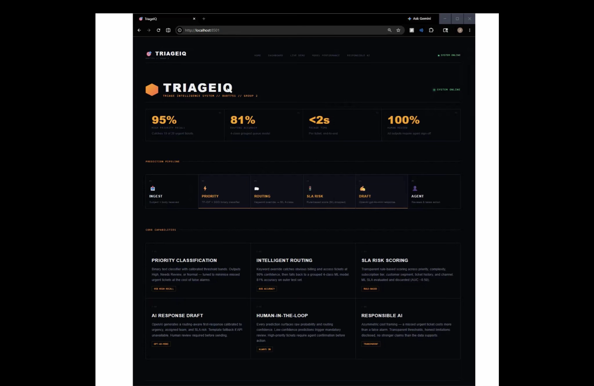
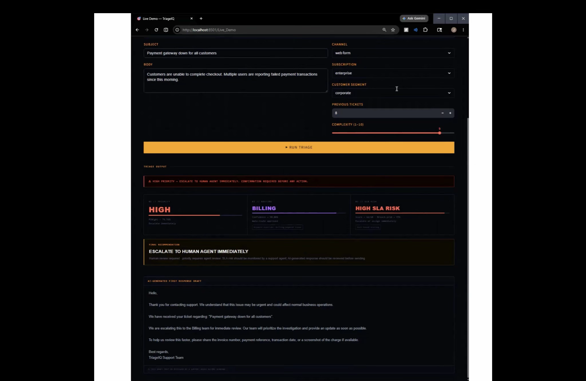

<div align="center">

<h1>TriageIQ</h1>

<h3>AI-assisted support ticket triage for faster prioritization, routing, SLA risk detection, and response drafting.</h3>

<p>
TriageIQ helps support teams reduce manual triage effort by turning incoming tickets into clear, reviewable actions for support agents.
</p>

<p>


</p>

</div>

---

## Overview

Support teams often spend significant time reading tickets, judging urgency, routing issues, checking SLA risk, and drafting first responses. This creates delays, inconsistent decisions, and higher operating costs.

**TriageIQ** is an AI-assisted triage layer that supports this first stage of ticket handling. It predicts ticket priority, recommends the right support group, scores SLA risk, and creates a first-response draft for human review.

The system is designed as an **agent-assist workflow**, not a fully automated replacement for support teams.

---

## Business Problem

| Challenge | Impact |
|---|---|
| Manual triage takes time | Slower first response and higher support cost |
| Priority decisions vary by agent | Urgent tickets can be missed or over-escalated |
| Tickets are routed incorrectly | More handoffs and slower resolution |
| SLA risk is hard to identify early | Teams react after tickets are already late |
| Agents write repetitive responses | Less time spent solving actual issues |

---

## Solution

TriageIQ converts an incoming support ticket into a clear support action.

<table>
<tr>
<td align="center"><b>Ticket Intake</b></td>
<td align="center">→</td>
<td align="center"><b>Priority Detection</b></td>
<td align="center">→</td>
<td align="center"><b>Queue Routing</b></td>
<td align="center">→</td>
<td align="center"><b>SLA Risk Score</b></td>
<td align="center">→</td>
<td align="center"><b>Agent Review</b></td>
</tr>
</table>

The final output includes:

| Output | Purpose |
|---|---|
| Priority | Identifies whether the ticket is urgent |
| Routing Group | Recommends the support team that should handle it |
| SLA Risk | Flags tickets that may need faster attention |
| Recommendation | Converts model outputs into a support action |
| Draft Response | Gives the agent a first-response starting point |

---

## Example Output Labels

| Priority Output | Meaning |
|---|---|
| 🔴 **High Priority** | Urgent ticket that should be escalated quickly |
| 🟡 **Needs Review** | Borderline or uncertain ticket that should be checked by an agent |
| 🟢 **Normal** | Standard ticket that can follow the normal queue |

| SLA Risk Output | Meaning |
|---|---|
| 🔴 **High SLA Risk** | Ticket may need immediate attention |
| 🟠 **Medium SLA Risk** | Ticket should be monitored closely |
| 🟢 **Low SLA Risk** | Ticket can follow normal handling |

---

## Key Results

| Area | Result | Business Meaning |
|---|---:|---|
| High-priority recall | ~95% | Catches most urgent tickets |
| Priority ROC-AUC | ~80% | Shows useful separation between urgent and non-urgent tickets |
| Baseline routing accuracy | ~55% | Original queue labels were too overlapping |
| Grouped routing accuracy | ~80.6% | Routing improves after grouping similar support queues |
| Grouped routing weighted F1 | ~80.1% | Stronger performance across grouped routing categories |
| High-confidence routing accuracy | ~95.6% | High-confidence tickets are safer to route automatically |
| SLA ML performance | ~0.49–0.50 ROC-AUC | SLA ML was rejected and replaced with transparent rule-based scoring |

---

## What Makes This Project Useful

- Uses machine learning where the data shows useful signal.
- Uses rule-based logic where ML is not reliable enough.
- Keeps humans in control for review and final action.
- Converts predictions into business-friendly decisions.
- Includes a working Streamlit prototype for interactive demo.
- Connects model outputs to support operations KPIs.

---

## How It Works

<table>
<tr>
<th>Component</th>
<th>Method</th>
<th>Output</th>
</tr>
<tr>
<td><b>Priority Detection</b></td>
<td>TF-IDF text features + supervised classifier</td>
<td>High / Needs Review / Normal</td>
</tr>
<tr>
<td><b>Queue Routing</b></td>
<td>Grouped routing classifier + confidence thresholds</td>
<td>Technical/Product, Billing, Customer Service, Business Support</td>
</tr>
<tr>
<td><b>SLA Risk</b></td>
<td>Transparent business-rule score</td>
<td>Low / Medium / High SLA Risk</td>
</tr>
<tr>
<td><b>Response Draft</b></td>
<td>Template-based or optional LLM-assisted response</td>
<td>Human-reviewed first response</td>
</tr>
</table>

---

## App Preview

### Dashboard



### Live Triage Demo



---

## Tech Stack

| Category | Tools |
|---|---|
| Programming | Python |
| Data Work | Pandas, NumPy |
| Machine Learning | Scikit-learn, XGBoost |
| Text Features | TF-IDF |
| Visualization | Matplotlib, Plotly |
| App Demo | Streamlit |
| Environment | Google Colab, VS Code |
| Design Approach | Human-in-the-loop, confidence thresholds, responsible AI |

---

## Repository Structure

```text
triageiq-ai-ticket-triage/
├── README.md
├── requirements.txt
├── .gitignore
├── notebooks/
│   └── TriageIQ_Final_Modeling_Notebook.ipynb
├── streamlit_app/
│   ├── app.py
│   ├── README.md
│   ├── data/
│   ├── models/
│   ├── pages/
│   └── utils/
├── reports/
│   ├── TriageIQ_Project_Report.pdf
│   ├── TriageIQ_Final_Presentation.pdf
├── assets/
    ├── screenshots/
    └── demo/

```

---

## Important Files

| File / Folder | Purpose |
|---|---|
| `notebooks/` | Final modeling notebook with cleaning, training, evaluation, and output generation |
| `streamlit_app/app.py` | Main Streamlit application |
| `streamlit_app/models/` | Final trained priority and routing models |
| `streamlit_app/data/` | Final CSV files used by dashboard and demo |
| `reports/` | Final report, presentation, and detailed documentation |
| `assets/screenshots/` | App screenshots used in README |

---

## Run Locally

Clone the repository:

```bash
git clone https://github.com/your-username/triageiq-ai-ticket-triage.git
cd triageiq-ai-ticket-triage
```

Create and activate a virtual environment:

```bash
python3 -m venv .venv
source .venv/bin/activate
```

Install requirements:

```bash
python -m pip install --upgrade pip
python -m pip install -r requirements.txt
```

Run the app:

```bash
python -m streamlit run streamlit_app/app.py
```

Open the local URL shown in the terminal.

---

## Optional LLM Support

TriageIQ can run without an OpenAI API key. The core system uses saved ML models and rule-based logic.

If an OpenAI API key is provided, the app can optionally generate more customized ticket summaries and response drafts.

| Mode | Behavior |
|---|---|
| Without API key | ML predictions + rule-based SLA + template response draft |
| With API key | ML predictions + rule-based SLA + LLM-generated response draft |

If using the optional LLM feature, create:

```text
streamlit_app/.streamlit/secrets.toml
```

Add:

```toml
OPENAI_API_KEY = "your-key-here"
```

Do not commit this file to GitHub.

---

## Responsible AI Design

| Risk | Design Response |
|---|---|
| Missed urgent tickets | Priority model optimized for high recall |
| Over-escalation | Uses a Needs Review middle category |
| Wrong routing | Uses confidence thresholds and human review |
| Weak SLA ML signal | Uses transparent rule-based scoring instead |
| AI-generated response risk | Drafts require human approval |
| Data limitations | Synthetic/anonymized data limitations are documented |

---

## Limitations

| Limitation | Impact |
|---|---|
| Some datasets are synthetic or anonymized | Results should be treated as prototype evidence |
| Routing labels are grouped | System predicts broad support groups, not every sub-team |
| SLA ML did not perform reliably | Rule-based SLA risk is used in the final workflow |
| Production deployment needs real company data | Further validation and monitoring would be required |

---

## Future Improvements

- Integrate with Jira Service Management, Freshservice, Zendesk, or ServiceNow APIs.
- Add an agent feedback loop to learn from accepted, edited, and rejected recommendations.
- Improve multilingual routing using language-agnostic embeddings.
- Add operational SLA features such as queue backlog, ticket age, and agent workload.
- Enhance response drafts with optional LLM-assisted summaries.
- Deploy the Streamlit app as an internal support operations demo.

---

## Project Status

| Component | Status |
|---|---|
| Data cleaning and modeling notebook | Complete |
| Priority detection model | Complete |
| Grouped routing model | Complete |
| SLA risk scoring | Complete |
| Streamlit app | Working locally |
| Reports and documentation | Complete |
| Improving SLA model | In progress |

---

<p align="center">
      Author : <b>Hrishad Amre</b><br>
      <sub>
       · MS Information Systems · University of Maryland
      </sub>
</p>

<p align="center">
  <sub>
    Applied AI · Business Analytics · Streamlit · Responsible AI
  </sub>
</p>
